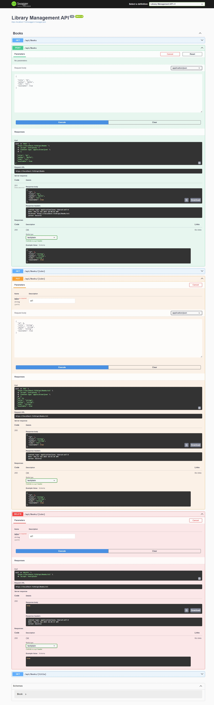

# Library Management API

This is a simple RESTful API built using ASP.NET Core for managing books in a library system.

## Features

- Add, update, retrieve, and delete books.
- Search books by ISBN or title.
- All operations are performed on in-memory data (no database).

## Setup and Run

### Prerequisites

- .NET SDK 6.0 or higher
- Visual Studio or Visual Studio Code (or any other C# IDE)
- A web browser or API client (like Postman or Swagger)

### Steps to Run the API

1. Clone or download the repository.
2. Open the project in your preferred C# IDE.
3. Open a terminal/command prompt in the project directory.
4. Run the following commands:

```bash
dotnet restore     # Restore dependencies
dotnet build       # Build the project
dotnet run         # Run the application
```

5. The API will be hosted locally (e.g., `https://localhost:5001/`).

## API Endpoints

### GET /api/books
Retrieve a list of all books in the library.

#### Response:
- 200 OK: Returns an array of books.

### GET /api/books/{isbn}
Retrieve a book by ISBN.

#### Response:
- 200 OK: Returns the book object.
- 404 Not Found: If no book with the given ISBN is found.

### POST /api/books
Add a new book to the library.

#### Example Request Body:
```json
{
  "Title": "The Great Gatsby",
  "Author": "F. Scott Fitzgerald",
  "ISBN": "978-0743273565",
  "Available": true
}
```
#### Response:
- 201 Created: The book is added to the library.
- 400 Bad Request: If a book with the same ISBN already exists.

### PUT /api/books/{isbn}
Update a book's details by ISBN.

#### Example Request Body:
```json
{
  "Title": "The Great Gatsby",
  "Author": "F. Scott Fitzgerald",
  "ISBN": "978-0743273565",
  "Available": false
}
```

#### Response:
- 200 OK: The book is updated.
- 404 Not Found: If the book is not found.

### DELETE /api/books/{isbn}
Delete a book by ISBN.

#### Example Request:
```http
DELETE /api/books/978-0743273565
```

#### Response:
- 200 OK: The book is deleted.
- 404 Not Found: If the book is not found.

## Error Handling

- Bad Request (400): Invalid input or missing parameters.
- Not Found (404): The requested book or resource does not exist.

## Example Responses

### GET /api/books/978-0743273565
```json
{
  "Id": 1,
  "Title": "The Great Gatsby",
  "Author": "F. Scott Fitzgerald",
  "ISBN": "978-0743273565",
  "Available": true
}
```

### POST /api/books
```json
{
  "Id": 2,
  "Title": "1984",
  "Author": "George Orwell",
  "ISBN": "978-0451524935",
  "Available": true
}
```

## Conclusion

This API allows you to manage books in a simple library system. The data is stored in-memory, and the API supports standard CRUD operations.


## Screenshots of API Responses:



